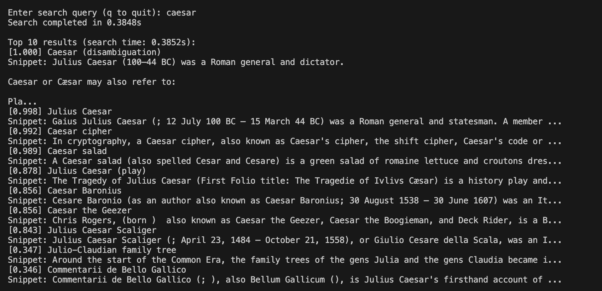
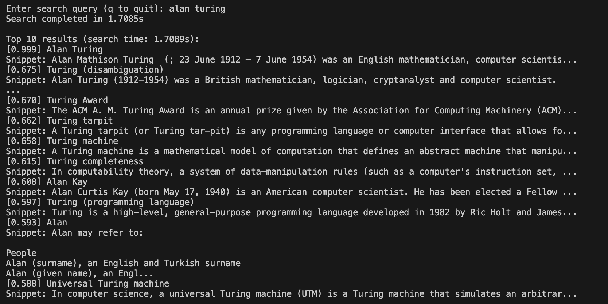
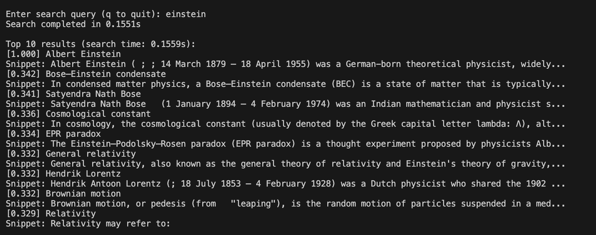

# Wikipedia Search Engine

A fast and efficient search engine built to search through Wikipedia articles using BM25 ranking and title similarity scoring. This project demonstrates strong skills in information retrieval, ranking algorithms, and Python programming.

---

## **Features**
- **BM25 Ranking**: Implements the BM25 algorithm for relevance scoring.
- **Title Similarity**: Combines BM25 with title similarity for improved results.
- **Preprocessing**: Tokenization, stopword removal, and stemming for efficient indexing.
- **Scalable**: Tested on 100,000 articles with search times of ~1 second.
- **Readable Snippets**: Displays human-readable snippets from the original text.

---

## **How It Works**
1. **Data Loading**: Loads Wikipedia articles using the Hugging Face `datasets` library.
2. **Preprocessing**: Tokenizes, removes stopwords, and stems the text for indexing.
3. **Indexing**: Builds an inverted index for fast retrieval.
4. **Search**: Combines BM25 and title similarity scores to rank results.
5. **Results**: Displays the top 10 results with titles, scores, and snippets.

---

## **How to Run**

### Clone the repository:

```bash
git clone https://github.com/Gronoxx/Wikipedia-Search-Engine.git
cd wikipedia-search-engine
```

### Install the required libraries using:
```bash
pip install -r requirements.txt
```

### Run the search engine:

```bash
python search.py
```

## Attention ⚠️

The following lines in the code specify the cache directory for the Hugging Face dataset:

```bash
cache_dir = '/Users/gustavo/.cache/huggingface/datasets'
dataset = load_dataset("wikipedia", "20220301.en", trust_remote_code=True, cache_dir=cache_dir)
```

cache_dir: This is the directory where the dataset will be downloaded and stored. The path /Users/gustavo/.cache/huggingface/datasets is specific to the user's system. You should change it to a directory that exists on your machine. For example:

**On Linux/Mac: /home/your-username/.cache/huggingface/datasets**

**On Windows: C:\Users\your-username\.cache\huggingface\datasets**

load_dataset: This function loads the Wikipedia dataset. The cache_dir parameter ensures that the dataset is stored in the specified directory. If you don't specify a cache_dir, the dataset will be stored in the default cache directory of the Hugging Face library.

## Why Is This Code Efficient?

The search engine is designed to be efficient and scalable. Here’s why:

### 1. Inverted Index

The inverted index allows for fast retrieval of documents containing specific terms. Instead of scanning all articles, the search engine only looks at the relevant postings for each query term.

### 2. Preprocessing

Stopword removal and stemming reduce the size of the index and improve search efficiency by focusing on meaningful terms.

### 3. Precomputed Statistics

The BM25 scores and title similarities rely on precomputed statistics (e.g., document frequencies, term frequencies, and title magnitudes). This avoids redundant calculations during search.

### 4. Cosine Similarity Optimization

The _calculate_title_scores function uses precomputed title token sets and magnitudes to efficiently calculate cosine similarity without recomputing these values for each query.

### 5. Scalability

The search engine has been tested on 100,000 articles with search times of ~1 second. This demonstrates its ability to handle large datasets efficiently.

### Not that efficcient

This code is a learning project and has several limitations that wouldn't be suitable for a real-world application. However, given my limited resources, I am very satisfied with it as my first project in the ranking field. Here are some key considerations:

**Indexing Slowness**

The current implementation processes data sequentially in pure Python, resulting in an O(N·T) time complexity. This makes indexing slow.

**Linear Scoring**

The system scores all candidate documents, even for common terms, which is inefficient.

**Lack of Advanced Signals**

The project does not incorporate advanced ranking signals like PageRank (link analysis), BERT (semantic understanding), or user behavior tracking.

**Memory Usage and Scalability Issues**

The system stores all data in RAM, making it inefficient for handling more than ~100,000 documents.


## Performance

**Dataset Size:** 100,000 Wikipedia articles.
**Search Time:** ~1 second for top 10 results.
**Accuracy:** Combines BM25 and title similarity for high-quality results.

## Examples

### Caesar



### Alan Turing



### Einstein




Due to the limited dataset loaded, not all searches may return results. For better outcomes, **prioritize queries starting with the first letters of the alphabet** (e.g., "A," "B," "C"), as the dataset may have more entries for these terms.

## Code Structure

search.py: Main script for loading data, indexing, and searching.

Classes:

SearchEngine: Handles data loading, preprocessing, indexing, and searching.

Methods:

_preprocess_text: Tokenizes and stems text.
_calculate_title_scores: Calculates the score of titles with cosine similarity. 
_bm25_score: Computes BM25 scores.
search: Combines BM25 and title similarity for ranking.

